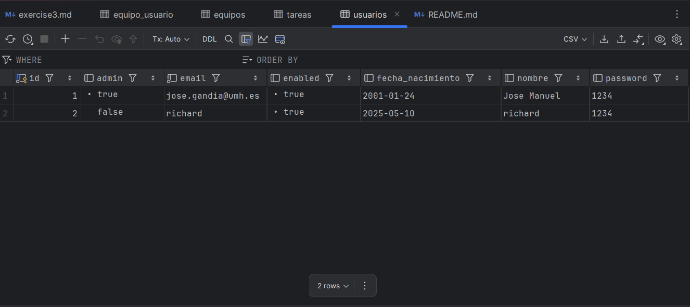
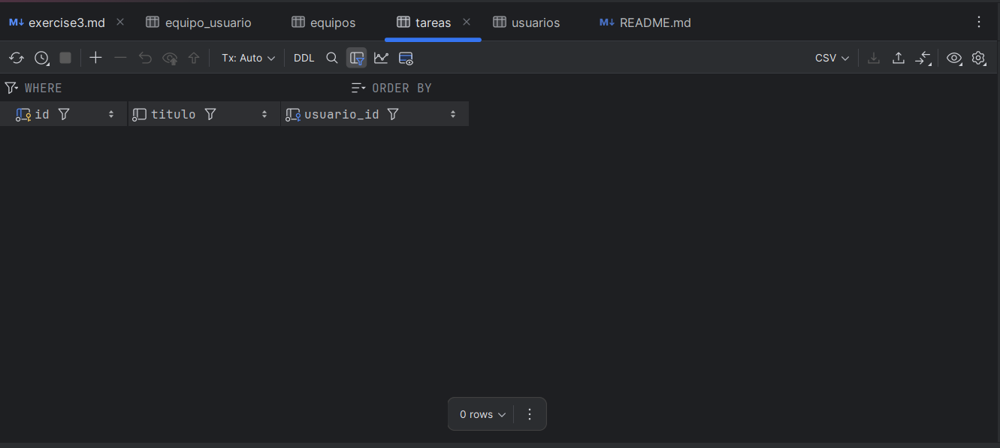
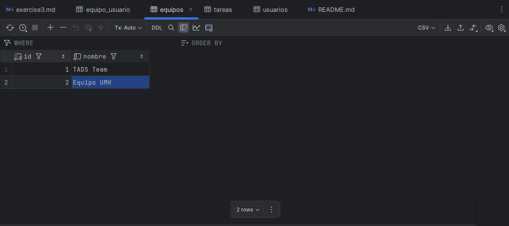
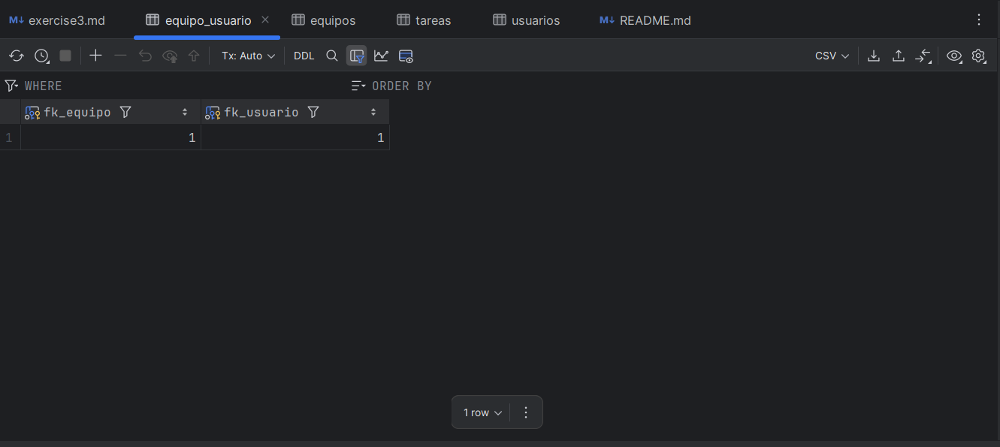

# To Do List app

ToDoList app usign Spring Boot and Thymeleaf templates.

## Requirements

You need install on your system:

- Java 8 SDK

## Ejecución

You can run the app using the goal `run` from Maven's _plugin_ 
on Spring Boot:

```
$ ./mvn spring-boot:run 
```   

You can already create a `jar` file and run it:

```
$ ./mvn package
$ java -jar target/todolist-inicial-0.0.1-SNAPSHOT.jar 
```

Once the app is running, you can open your favourite browser and connect to:

- [http://localhost:8080/login](http://localhost:8080/login)

Database Tables Screenshots







Useful Links: 
- GitHub Repository: https://github.com/JMGanzar/Hands-On-Classes-3
- Trello's Board: https://trello.com/b/qwBdSOAF/p2-y-p3-to-do-list-app
- Docker Image: https://hub.docker.com/r/jmganzar/p3-todolistapp/tags