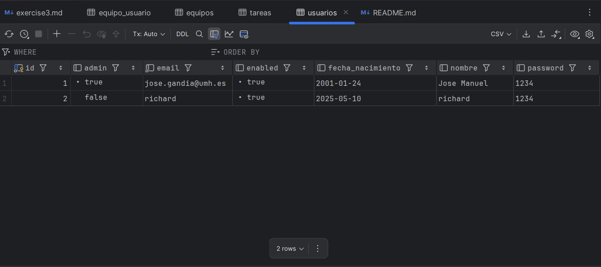

**Documentation for User Stories 009, 010, and 011**

---

### 1. Overview

This documentation provides a comprehensive technical overview of the implementation of user stories 009 (Manage Team Membership), 010 (Team Management), and 011 (Create Teams) in the ToDoList application. The application is built using Spring Boot and utilizes a PostgreSQL database for data persistence. This document details the defined paths (endpoints), classes and methods, Thymeleaf templates, tests, and code explanations associated with these user stories.

### 2. User Story 009: Manage Team Membership

**Description**: As a user, I will be able to add or remove myself from any existing teams to participate or stop participating in them.

#### 2.1 Defined Paths (Endpoints)

- **Add User to Team**:
    - **Path**: `/teams/{teamId}/addUser `
    - **Method**: `POST`
    - **Description**: Endpoint to add a user to a specified team.

- **Remove User from Team**:
    - **Path**: `/teams/{teamId}/removeUser `
    - **Method**: `POST`
    - **Description**: Endpoint to remove a user from a specified team.

#### 2.2 Classes and Methods

- **Controller**: `TeamsController`
    - **Methods**:
        - `addUser ToTeam(Long teamId, Long userId)`: Adds a user to the specified team.
        - `removeUser FromTeam(Long teamId, Long userId)`: Removes a user from the specified team.

- **Service**: `EquipoService`
    - **Methods**:
        - `añadirUsuarioAEquipo(Long teamId, Long userId)`: Adds a user to the specified team.
        - `eliminarUsuarioDeEquipo(Long teamId, Long userId)`: Removes a user from the specified team.

- **Repository**: `EquipoRepository`
    - **Methods**:
        - `save(Equipo equipo)`: Saves the team entity to the database.
        - `findById(Long id)`: Retrieves a team by its ID.

#### 2.3 Thymeleaf Templates

- **Team Membership Management**: `teamsList.html`
    - Displays a list of teams the user is a member of, with options to add or remove themselves from teams.

### 3. User Story 010: Team Management

**Description**: As an administrator, I can rename and delete teams to adapt them to the projects and structure of the company.

#### 3.1 Defined Paths (Endpoints)

- **Rename Team**:
    - **Path**: `/teams/{teamId}/rename`
    - **Method**: `POST`
    - **Description**: Endpoint to rename a specified team.

- **Delete Team**:
    - **Path**: `/teams/{teamId}/delete`
    - **Method**: `POST`
    - **Description**: Endpoint to delete a specified team.

#### 3.2 Classes and Methods

- **Controller**: `TeamsController`
    - **Methods**:
        - `renameTeam(Long teamId, String newName)`: Renames the specified team.
        - `deleteTeam(Long teamId)`: Deletes the specified team.

- **Service**: `EquipoService`
    - **Methods**:
        - `renombrarEquipo(Long teamId, String newName)`: Renames the specified team.
        - `eliminarEquipo(Long teamId)`: Deletes the specified team.

- **Repository**: `EquipoRepository`
    - **Methods**:
        - `deleteById(Long id)`: Deletes a team by its ID.

#### 3.3 Thymeleaf Templates

- **Rename Team Form**: `editTeam.html`
    - Contains a form for administrators to input the new name for the team.

- **Team Management**: `teamsList.html`
    - Displays a list of teams with options for administrators to rename or delete teams.

### 4. User Story 011: Create Teams

**Description**: As a user, I will be able to create new teams to facilitate collaboration and organization within the application.

#### 4.1 Defined Paths (Endpoints)

- **Create Team**:
    - **Path**: `/teams/create`
    - **Method**: `POST`
    - **Description**: Endpoint to create a new team.

#### 4.2 Classes and Methods

- **Controller**: `TeamsController`
    - **Methods**:
        - `createTeam(TeamData teamData)`: Handles the creation of a new team.

- **Service**: `EquipoService`
    - **Methods**:
        - `crearEquipo(String nombre)`: Creates a new team and returns the created team data.

- **Repository**: `EquipoRepository`
    - **Methods**:
        - `save(Equipo equipo)`: Saves the new team entity to the database.

#### 4.3 Thymeleaf Templates

- **Create Team Form**: `create-team.html`
    - Contains a form for users to input the name of the new team they wish to create.

### 5. Tests

#### 5.1 Unit Tests

- **Test Class**: `EquipoServiceTest`
    - **Tests**:
        - `testCrearEquipo()`: Tests the creation of a new team.
        - `testAñadirUsuarioAEquipo()`: Tests adding a user to a team.
        - `testEliminarUsuarioDeEquipo()`: Tests removing a user from a team.
        - `testRenombrarEquipo()`: Tests renaming a team.
        - `testEliminarEquipo()`: Tests deleting a team.

#### 5.2 Integration Tests

- **Test Class**: `TeamsControllerTest`
    - **Tests**:
        - `testCreateTeam()`: Tests the endpoint for creating a new team.
        - `testAddUser ToTeam()`: Tests the endpoint for adding a user to a team.
        - `testRemoveUser FromTeam()`: Tests the endpoint for removing a user from a team.
        - `testRenameTeam()`: Tests the endpoint for renaming a team.
        - `testDeleteTeam()`: Tests the endpoint for deleting a team.
        - `testAddUser ToTeamNotFound()`: Tests adding a user to a non-existent team.
        - `testRemoveUser FromTeamNotFound()`: Tests removing a user from a non-existent team.
        - `testRenameTeamNotFound()`: Tests renaming a non-existent team.
        - `testDeleteTeamNotFound()`: Tests deleting a non-existent team.

### 6. Relevant Code Examples Explained

#### 6.1 Logic for Creating Teams (User Story 011)

```java
// TeamsController.java
@PostMapping("/create")
public String createTeam(@ModelAttribute TeamData teamData,
Authentication authentication) {

    UserDetails userDetails = (UserDetails) authentication.getPrincipal();
    Usuario creador = usuarioService.findByEmail(userDetails.getUsername());
    
    equipoService.crearEquipo(teamData.getNombre(), creador);
    return "redirect:/teams";
}

// EquipoService.java
public void crearEquipo(String nombre, Usuario creador) {
Equipo nuevoEquipo = new Equipo(nombre);
nuevoEquipo.setCreador(creador);
nuevoEquipo.getMiembros().add(creador);  // Creador es miembro automático
equipoRepository.save(nuevoEquipo);
}
```
##### Explanation:

- The team creator is obtained directly from the Spring security context.
- A bidirectional relationship is established: the user is added as a member of the team, and the team is associated with the user.
- Correct persistence of JPA relationships is ensured through CascadeType.PERSIST.

#### 6.2 Admin Validation (User Story 010)

```java
// TeamsController.java
@PostMapping("/{teamId}/delete")
public String deleteTeam(@PathVariable Long teamId,
Authentication authentication,
RedirectAttributes redirectAttributes) {

    UserDetails userDetails = (UserDetails) authentication.getPrincipal();
    Usuario usuario = usuarioService.findByEmail(userDetails.getUsername());
    
    if(!equipoService.esAdministrador(teamId, usuario.getId())) {
        redirectAttributes.addFlashAttribute("error", "Solo los administradores pueden eliminar equipos");
        return "redirect:/teams";
    }
    
    equipoService.eliminarEquipo(teamId);
    return "redirect:/teams";
}
```
##### Explanation:

- Permission verification in the controller before executing sensitive operations.
- Use of RedirectAttributes to send flash messages to the client.
- Clear separation between authorization logic and business operations.

#### 6.3 Member Management (User Story 009)

```java
// EquipoService.java
@Transactional
public void añadirUsuarioAEquipo(Long teamId, Long userId) {
Equipo equipo = equipoRepository.findById(teamId)
.orElseThrow(() -> new EntityNotFoundException("Equipo no encontrado"));

    Usuario usuario = usuarioRepository.findById(userId)
        .orElseThrow(() -> new EntityNotFoundException("Usuario no encontrado"));
    
    if(!equipo.getMiembros().contains(usuario)) {
        equipo.getMiembros().add(usuario);
        usuario.getEquipos().add(equipo);
    }
}

// TeamsController.java
@PostMapping("/{teamId}/addUser")
public String addSelfToTeam(@PathVariable Long teamId,
Authentication authentication) {
UserDetails userDetails = (UserDetails) authentication.getPrincipal();
Usuario usuario = usuarioService.findByEmail(userDetails.getUsername());

    equipoService.añadirUsuarioAEquipo(teamId, usuario.getId());
    return "redirect:/teams/" + teamId;
}
```
##### Explanation:

- Use of transactions (@Transactional) to maintain data consistency.
- Verification of existing membership to prevent duplicates.
- Self-join pattern where the authenticated user is automatically the subject of the action.

#### 6.4 JPA Relationships in Entities

```java
// Entidad Equipo.java
@Entity
public class Equipo {
@Id
@GeneratedValue(strategy = GenerationType.IDENTITY)
private Long id;

    private String nombre;
    
    @ManyToOne
    private Usuario creador;
    
    @ManyToMany
    @JoinTable(
        name = "equipo_usuario",
        joinColumns = @JoinColumn(name = "equipo_id"),
        inverseJoinColumns = @JoinColumn(name = "usuario_id")
    )
    private Set<Usuario> miembros = new HashSet<>();
    
    // Constructor, getters y setters
}

// Entidad Usuario.java
@Entity
public class Usuario {
// ...
@ManyToMany(mappedBy = "miembros")
private Set<Equipo> equipos = new HashSet<>();
}
```
##### Explanation:

- @ManyToMany relationship with explicit join table (equipo_usuario).
- Bidirectional mapping with mappedBy to avoid relationship duplication.
- Use of Set instead of List for many-to-many relationships for efficiency.

### 7. Database Tables Screenshots




### 8. Useful Links

- **GitHub Repository**: https://github.com/JMGanzar/Hands-On-Classes-3
- **Trello's Board**: https://trello.com/b/qwBdSOAF/p2-y-p3-to-do-list-app
- **Docker Image**: https://hub.docker.com/r/jmganzar/p3-todolistapp/tags